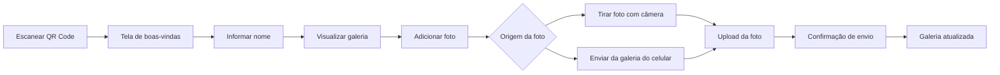
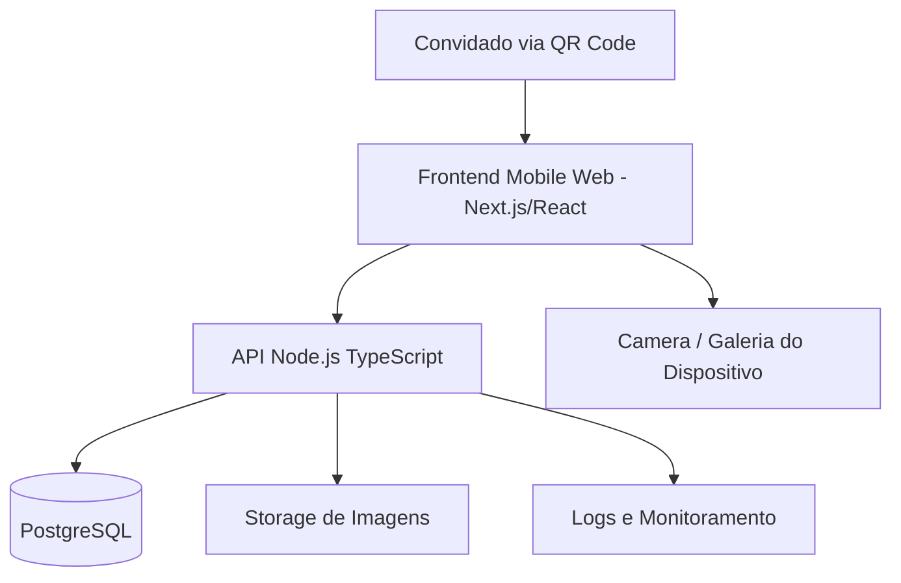

# PRD — Álbum Colaborativo de Casamento

**Produto:** Aplicação web mobile para convidados compartilharem fotos do casamento  
**Versão:** 1.0 — MVP  
**Data:** 29/05/2026  
**Stack sugerida:** Node.js + TypeScript  
**Formato de uso:** Acesso via QR Code, sem necessidade de login

---

## 1. Contexto do projeto

Durante o casamento, os convidados costumam tirar fotos espontâneas que nem sempre chegam aos noivos depois do evento. A proposta é criar uma aplicação simples, acessível por QR Code, onde o convidado entra, informa seu nome e pode compartilhar fotos diretamente em uma galeria colaborativa do casamento.

A aplicação deve funcionar bem em celular, com uma jornada extremamente simples:

1. Convidado escaneia o QR Code.
2. Acessa a tela de boas-vindas.
3. Informa seu nome.
4. Visualiza a galeria do casamento.
5. Escolhe entre tirar uma foto na hora ou anexar uma foto da galeria do celular.
6. A foto é enviada.
7. A foto aparece na galeria do evento.

A experiência precisa ser leve, bonita, rápida e sem fricção. O foco é capturar momentos reais do evento sem exigir cadastro, senha ou instalação de aplicativo.

---

## 2. Objetivo do produto

Criar uma aplicação web mobile-first para que convidados possam compartilhar fotos do casamento em tempo real, formando uma galeria colaborativa acessível durante e após o evento.

---

## 3. Problema a ser resolvido

Hoje, as fotos tiradas pelos convidados ficam espalhadas em celulares, grupos de WhatsApp, redes sociais ou simplesmente não são compartilhadas. Isso gera perda de registros espontâneos e dificulta a centralização das memórias do evento.

---

## 4. Proposta de valor

Para os noivos:

- Centralizar fotos dos convidados em uma única galeria.
- Capturar momentos espontâneos que o fotógrafo oficial talvez não registre.
- Ter uma lembrança coletiva do evento.

Para os convidados:

- Compartilhar fotos de forma rápida e simples.
- Não precisar baixar aplicativo.
- Ver fotos compartilhadas por outros convidados.
- Participar ativamente da construção do álbum do casamento.

---

## 5. Público-alvo

### 5.1 Convidado

Pessoa presente no casamento que acessa o app via QR Code para visualizar e enviar fotos.

### 5.2 Noivos / organizadores

Usuários responsáveis por disponibilizar o QR Code e acessar a galeria consolidada após o evento.

### 5.3 Administrador técnico

Pessoa responsável por configurar o evento, acompanhar uploads e manter a aplicação funcionando.

---

## 6. Princípios de UX

- **Zero fricção:** não exigir login, senha ou cadastro completo.
- **Mobile-first:** experiência pensada prioritariamente para celular.
- **Jornada curta:** em até 3 interações o convidado deve conseguir enviar uma foto.
- **Clareza visual:** CTAs evidentes e linguagem simples.
- **Feedback imediato:** toda ação crítica deve ter confirmação visual.
- **Contexto emocional:** interface elegante, acolhedora e alinhada ao casamento.
- **Acessibilidade básica:** contraste adequado, botões grandes e textos objetivos.

---

## 7. Jornada do usuário



---

## 8. Escopo do MVP

### 8.1 Dentro do escopo

- Acesso por QR Code.
- Tela de boas-vindas.
- Identificação simples por nome.
- Criação de sessão do convidado.
- Galeria pública do casamento.
- Upload de imagem a partir da galeria do celular.
- Captura de imagem usando a câmera do celular.
- Preview ou confirmação da foto enviada.
- Exibição da foto enviada na galeria.
- Armazenamento das fotos em serviço de storage.
- Registro de metadados da foto:
  - nome do convidado;
  - data/hora do envio;
  - identificador do evento;
  - URL da imagem;
  - status da foto.
- Layout responsivo para celular.
- Validação de tipos e tamanho de arquivo.
- Feedback de erro e sucesso.

### 8.2 Fora do escopo do MVP

- Login com e-mail, Google ou redes sociais.
- Comentários nas fotos.
- Curtidas.
- Compartilhamento em redes sociais.
- Edição avançada de imagem.
- Filtros de foto.
- Upload de vídeos.
- Moderação manual avançada.
- Reconhecimento facial.
- IA para classificação de fotos.
- Aplicativo nativo iOS/Android.

---

## 9. Funcionalidades principais

### RF01 — Acesso via QR Code

O sistema deve permitir que o convidado acesse a aplicação por meio de um QR Code único do evento.

### RF02 — Tela de boas-vindas

O sistema deve apresentar uma tela inicial com mensagem do casamento e botão para iniciar a experiência.

### RF03 — Identificação do convidado

O sistema deve solicitar o nome do convidado antes de permitir o envio de fotos.

### RF04 — Galeria do casamento

O sistema deve exibir uma galeria com as fotos já compartilhadas pelos convidados.

### RF05 — Adicionar foto

O sistema deve permitir que o convidado escolha entre tirar uma foto com a câmera ou anexar uma foto existente.

### RF06 — Capturar foto pela câmera

O sistema deve abrir a câmera do dispositivo para captura de imagem.

### RF07 — Upload de foto da galeria do celular

O sistema deve permitir a seleção de uma imagem local do dispositivo.

### RF08 — Confirmação de envio

O sistema deve apresentar uma mensagem de sucesso após o upload da foto.

### RF09 — Galeria atualizada

O sistema deve exibir a foto recém-enviada na galeria do casamento.

### RF10 — Persistência de sessão

O sistema deve manter o nome do convidado no navegador para evitar que ele precise preencher novamente durante o evento.

---

## 10. Requisitos não funcionais

### RNF01 — Performance

A aplicação deve carregar rapidamente em conexão móvel comum. A primeira renderização deve ser otimizada para ambiente de evento, onde a rede pode estar instável.

### RNF02 — Responsividade

A aplicação deve ser desenvolvida com foco em celulares, mas também funcionar em tablets e desktops.

### RNF03 — Segurança

O sistema deve validar arquivos enviados, restringir formatos permitidos e impedir uploads maliciosos.

### RNF04 — Privacidade

O sistema deve evitar exposição de dados sensíveis. O nome informado pelo convidado deve ser usado apenas para identificação da autoria da foto.

### RNF05 — Compatibilidade

A aplicação deve funcionar nos principais navegadores mobile:
- Safari iOS;
- Chrome Android;
- Chrome iOS;
- Samsung Internet.

### RNF06 — Disponibilidade

A aplicação deve suportar picos de acesso durante o evento.

### RNF07 — Escalabilidade

O storage de imagens deve ser externo à aplicação, evitando gravar arquivos diretamente no servidor Node.js.

### RNF08 — Observabilidade

O sistema deve registrar erros de upload, falhas de API e eventos críticos da jornada.

---

## 11. Stack técnica sugerida

### 11.1 Frontend

- **Next.js com TypeScript**
- React
- CSS Modules, Tailwind CSS ou Styled Components
- PWA opcional
- HTML input com suporte a câmera:
  - `accept="image/*"`
  - `capture="environment"` ou `capture="user"`

### 11.2 Backend

- **Node.js com TypeScript**
- Framework sugerido:
  - NestJS para estrutura robusta; ou
  - Fastify para backend leve e performático; ou
  - Next.js API Routes para MVP mais simples.
- Validação com Zod ou class-validator.
- ORM com Prisma.

### 11.3 Banco de dados

- PostgreSQL para produção.
- SQLite apenas para protótipo local.

### 11.4 Storage de arquivos

Opções recomendadas:

- AWS S3;
- Cloudflare R2;
- Azure Blob Storage;
- Google Cloud Storage.

### 11.5 Deploy

Opções recomendadas:

- Vercel para frontend/Next.js;
- Render, Railway, Fly.io ou AWS para backend;
- Banco gerenciado;
- Storage externo.

---

## 12. Arquitetura sugerida



---

## 13. Modelo de dados

### 13.1 Event

Representa o casamento/evento.

| Campo | Tipo | Obrigatório | Descrição |
|---|---|---:|---|
| id | string/uuid | Sim | Identificador do evento |
| slug | string | Sim | Slug usado na URL do QR Code |
| name | string | Sim | Nome do evento |
| coupleName | string | Sim | Nome dos noivos |
| eventDate | date | Sim | Data do casamento |
| isActive | boolean | Sim | Indica se o evento está ativo |
| createdAt | datetime | Sim | Data de criação |

### 13.2 GuestSession

Representa a identificação simples do convidado.

| Campo | Tipo | Obrigatório | Descrição |
|---|---|---:|---|
| id | string/uuid | Sim | Identificador da sessão |
| eventId | string/uuid | Sim | Evento vinculado |
| guestName | string | Sim | Nome informado pelo convidado |
| deviceId | string | Não | Identificador anônimo do navegador |
| createdAt | datetime | Sim | Data de criação |

### 13.3 Photo

Representa uma foto enviada para a galeria.

| Campo | Tipo | Obrigatório | Descrição |
|---|---|---:|---|
| id | string/uuid | Sim | Identificador da foto |
| eventId | string/uuid | Sim | Evento vinculado |
| guestSessionId | string/uuid | Sim | Sessão do convidado |
| guestName | string | Sim | Nome do convidado no momento do envio |
| imageUrl | string | Sim | URL pública ou assinada da imagem |
| thumbnailUrl | string | Não | URL da versão otimizada |
| status | enum | Sim | `published`, `processing`, `rejected` |
| originalFileName | string | Não | Nome original do arquivo |
| mimeType | string | Sim | Tipo do arquivo |
| sizeInBytes | number | Sim | Tamanho do arquivo |
| createdAt | datetime | Sim | Data de envio |

---

## 14. APIs sugeridas

### GET `/api/events/:slug`

Busca os dados públicos do evento.

**Resposta esperada:**

```json
{
  "id": "event_123",
  "name": "Casamento Ana e Bruno",
  "coupleName": "Ana & Bruno",
  "eventDate": "2026-09-12",
  "isActive": true
}
```

---

### POST `/api/events/:eventId/guest-sessions`

Cria ou atualiza a sessão do convidado.

**Body:**

```json
{
  "guestName": "Rogério"
}
```

**Resposta esperada:**

```json
{
  "guestSessionId": "guest_123",
  "guestName": "Rogério"
}
```

---

### GET `/api/events/:eventId/photos`

Lista fotos publicadas do evento.

**Query params opcionais:**

```txt
?page=1&limit=30
```

**Resposta esperada:**

```json
{
  "items": [
    {
      "id": "photo_123",
      "imageUrl": "https://storage.com/photo.jpg",
      "thumbnailUrl": "https://storage.com/photo-thumb.jpg",
      "guestName": "Rogério",
      "createdAt": "2026-09-12T22:30:00Z"
    }
  ],
  "page": 1,
  "limit": 30,
  "hasNextPage": false
}
```

---

### POST `/api/events/:eventId/photos`

Envia uma foto para a galeria.

**Formato:** `multipart/form-data`

| Campo | Tipo | Obrigatório | Descrição |
|---|---|---:|---|
| guestSessionId | string | Sim | Sessão do convidado |
| file | file | Sim | Arquivo de imagem |

**Resposta esperada:**

```json
{
  "id": "photo_123",
  "status": "published",
  "imageUrl": "https://storage.com/photo.jpg"
}
```

---

## 15. Validações

### Nome do convidado

- Obrigatório.
- Mínimo de 2 caracteres.
- Máximo de 80 caracteres.
- Remover espaços duplicados.
- Bloquear apenas números ou caracteres inválidos.

### Arquivo de imagem

- Formatos aceitos:
  - JPG;
  - JPEG;
  - PNG;
  - HEIC, se houver suporte no pipeline.
- Tamanho máximo sugerido: 10 MB.
- Rejeitar arquivos sem MIME type válido.
- Gerar mensagem amigável para erro de upload.

---

## 16. Estados da interface

### Estados obrigatórios

- Carregando evento.
- Evento indisponível.
- Nome inválido.
- Galeria vazia.
- Galeria carregando.
- Upload em andamento.
- Upload concluído.
- Erro no upload.
- Sem permissão de câmera.
- Arquivo inválido.
- Foto publicada.

---

## 17. Critérios de sucesso do MVP

- Convidado consegue acessar via QR Code.
- Convidado consegue informar o nome.
- Convidado consegue visualizar a galeria.
- Convidado consegue enviar uma foto da galeria do celular.
- Convidado consegue tirar uma foto pela câmera.
- Foto enviada aparece na galeria.
- O app funciona bem em iOS e Android.
- O fluxo principal pode ser concluído sem login.
- Upload falho apresenta erro compreensível.
- Dados básicos da autoria são armazenados.

---

# 18. Backlog por épicos, histórias e tasks

## Épico 1 — Setup do projeto

### História 1.1 — Criar estrutura base do projeto

**Como** desenvolvedor,  
**quero** criar a base do projeto com Node.js e TypeScript,  
**para** iniciar o desenvolvimento com padrão técnico consistente.

**Critérios de aceite**

- Projeto inicializado com TypeScript.
- Scripts de desenvolvimento configurados.
- Lint e formatação configurados.
- Estrutura de pastas definida.
- Variáveis de ambiente documentadas.

**Tasks técnicas**

- Criar projeto Node.js com TypeScript.
- Configurar `tsconfig.json`.
- Configurar ESLint.
- Configurar Prettier.
- Criar estrutura inicial:
  - `src/modules`
  - `src/shared`
  - `src/config`
  - `src/database`
  - `src/services`
- Criar arquivo `.env.example`.
- Criar README inicial com instruções de execução.

---

### História 1.2 — Configurar framework backend

**Como** desenvolvedor,  
**quero** configurar o framework backend,  
**para** expor APIs de forma padronizada.

**Critérios de aceite**

- API sobe localmente.
- Health check disponível.
- Erros básicos são tratados.
- CORS configurado.

**Tasks técnicas**

- Escolher framework: NestJS, Fastify ou Express.
- Criar endpoint `GET /health`.
- Configurar tratamento global de erros.
- Configurar CORS.
- Configurar parse de JSON.
- Criar middleware de request log.

---

## Épico 2 — Evento e acesso via QR Code

### História 2.1 — Consultar evento pelo slug

**Como** convidado,  
**quero** acessar o app por uma URL do evento,  
**para** entrar na experiência correta do casamento.

**Critérios de aceite**

- URL do QR Code aponta para o slug do evento.
- Sistema valida se o evento existe.
- Sistema valida se o evento está ativo.
- Caso o evento não exista, exibe mensagem amigável.

**Tasks técnicas**

- Criar model `Event`.
- Criar migration da tabela `events`.
- Criar seed com evento de teste.
- Criar service `EventService`.
- Criar endpoint `GET /api/events/:slug`.
- Criar validação de evento ativo.
- Criar tela de erro para evento indisponível.

---

### História 2.2 — Criar tela de boas-vindas

**Como** convidado,  
**quero** ver uma tela inicial acolhedora,  
**para** entender que estou no álbum do casamento.

**Critérios de aceite**

- Tela exibe nome dos noivos ou nome do evento.
- Tela tem CTA principal `Começar`.
- Tela é responsiva em celular.
- Tela mantém identidade visual elegante.

**Tasks técnicas**

- Criar rota frontend `/e/[slug]`.
- Consumir endpoint de evento.
- Criar componente `WelcomeScreen`.
- Criar botão `Começar`.
- Criar estado de loading.
- Criar estado de erro.

---

## Épico 3 — Identificação do convidado

### História 3.1 — Informar nome do convidado

**Como** convidado,  
**quero** informar meu nome,  
**para** que minhas fotos sejam identificadas na galeria.

**Critérios de aceite**

- Campo de nome é obrigatório.
- Botão `Entrar` só avança com nome válido.
- Nome é salvo na sessão do navegador.
- Nome fica vinculado aos uploads futuros.

**Tasks técnicas**

- Criar tela `GuestNameScreen`.
- Criar validação de nome no frontend.
- Criar validação de nome no backend.
- Criar endpoint `POST /api/events/:eventId/guest-sessions`.
- Criar model `GuestSession`.
- Criar migration da tabela `guest_sessions`.
- Salvar `guestSessionId` no `localStorage`.
- Salvar `guestName` no `localStorage`.

---

### História 3.2 — Reutilizar sessão do convidado

**Como** convidado,  
**quero** não precisar informar meu nome toda vez,  
**para** usar o app com menos fricção.

**Critérios de aceite**

- Se existir sessão local válida, o usuário vai direto para a galeria.
- O usuário pode alterar o nome se necessário.
- Sessão é específica por evento.

**Tasks técnicas**

- Criar helper de sessão local.
- Salvar sessão por chave com `eventId`.
- Validar sessão ao carregar o evento.
- Criar opção simples para trocar nome.
- Criar testes da regra de sessão por evento.

---

## Épico 4 — Galeria de fotos

### História 4.1 — Exibir galeria do casamento

**Como** convidado,  
**quero** visualizar as fotos compartilhadas,  
**para** acompanhar os momentos registrados pelos outros convidados.

**Critérios de aceite**

- Galeria exibe fotos publicadas.
- Galeria mostra estado vazio quando não houver fotos.
- Galeria carrega de forma paginada ou incremental.
- Fotos são exibidas em grid responsivo.

**Tasks técnicas**

- Criar model `Photo`.
- Criar migration da tabela `photos`.
- Criar endpoint `GET /api/events/:eventId/photos`.
- Criar service `PhotoService`.
- Criar componente `PhotoGallery`.
- Criar grid responsivo.
- Criar loading skeleton.
- Criar estado de galeria vazia.
- Criar paginação ou infinite scroll.

---

### História 4.2 — Atualizar galeria após envio

**Como** convidado,  
**quero** ver minha foto na galeria após enviar,  
**para** ter confirmação visual de que ela entrou no álbum.

**Critérios de aceite**

- Após envio bem-sucedido, a galeria é atualizada.
- A foto recém-enviada aparece em destaque temporário.
- O usuário pode voltar para a galeria após a confirmação.

**Tasks técnicas**

- Invalidar cache/listagem após upload.
- Atualizar estado local da galeria.
- Criar destaque visual para nova foto.
- Criar botão `Ver galeria`.
- Criar animação simples de entrada da foto.

---

## Épico 5 — Adição de foto

### História 5.1 — Abrir opções para adicionar foto

**Como** convidado,  
**quero** escolher entre tirar uma foto ou enviar uma foto existente,  
**para** compartilhar o momento da forma mais conveniente.

**Critérios de aceite**

- Botão `Adicionar foto` está visível na galeria.
- Ao clicar, sistema exibe opções:
  - `Tirar foto`;
  - `Enviar da galeria`.
- O modal pode ser fechado sem ação.

**Tasks técnicas**

- Criar botão flutuante `AddPhotoButton`.
- Criar modal `AddPhotoOptions`.
- Criar opção `Tirar foto`.
- Criar opção `Enviar da galeria`.
- Criar comportamento de fechar modal.
- Criar testes de abertura/fechamento do modal.

---

### História 5.2 — Enviar foto da galeria do celular

**Como** convidado,  
**quero** escolher uma foto do meu celular,  
**para** adicioná-la ao álbum do casamento.

**Critérios de aceite**

- Sistema abre seletor de arquivos do celular.
- Apenas imagens são aceitas.
- Sistema valida tamanho e formato.
- Sistema envia a imagem para o backend.
- Sistema mostra sucesso ou erro.

**Tasks técnicas**

- Criar input file com `accept="image/*"`.
- Implementar handler de seleção de arquivo.
- Validar MIME type.
- Validar tamanho máximo.
- Criar chamada `multipart/form-data`.
- Criar barra ou estado de progresso.
- Criar mensagens de erro.
- Criar fluxo de sucesso.

---

### História 5.3 — Tirar foto usando câmera

**Como** convidado,  
**quero** tirar uma foto usando a câmera do celular,  
**para** registrar e enviar um momento na hora.

**Critérios de aceite**

- Sistema abre câmera do dispositivo.
- Foto capturada pode ser enviada.
- Caso a câmera não esteja disponível, sistema informa alternativa.
- Funciona em navegadores móveis compatíveis.

**Tasks técnicas**

- Criar input file com `accept="image/*"` e `capture`.
- Avaliar suporte a câmera em iOS e Android.
- Criar fallback para seleção da galeria.
- Criar tratamento para permissão negada.
- Reutilizar fluxo de upload da história 5.2.
- Testar em Safari iOS e Chrome Android.

---

## Épico 6 — Upload e armazenamento

### História 6.1 — Fazer upload da imagem

**Como** sistema,  
**quero** receber a foto enviada pelo convidado,  
**para** armazená-la e exibi-la na galeria.

**Critérios de aceite**

- Backend recebe arquivo via `multipart/form-data`.
- Backend valida formato e tamanho.
- Backend envia arquivo para storage externo.
- Backend salva metadados no banco.
- Backend retorna URL da foto criada.

**Tasks técnicas**

- Configurar biblioteca de upload.
- Criar endpoint `POST /api/events/:eventId/photos`.
- Criar validação de `guestSessionId`.
- Validar evento ativo.
- Validar arquivo recebido.
- Criar service de storage.
- Integrar com S3/R2/Azure Blob.
- Salvar registro na tabela `photos`.
- Retornar resposta padronizada.

---

### História 6.2 — Otimizar imagem enviada

**Como** sistema,  
**quero** otimizar a imagem enviada,  
**para** reduzir peso e melhorar carregamento da galeria.

**Critérios de aceite**

- Imagem original é redimensionada se ultrapassar tamanho máximo.
- Thumbnail é gerado para galeria.
- Galeria usa versão otimizada.
- Upload não degrada a experiência do usuário.

**Tasks técnicas**

- Integrar biblioteca `sharp`.
- Definir tamanho máximo da imagem principal.
- Definir tamanho da thumbnail.
- Gerar thumbnail no backend.
- Salvar URLs da imagem e thumbnail.
- Remover metadados EXIF sensíveis quando aplicável.
- Criar testes com imagens grandes.

---

### História 6.3 — Tratar falhas de upload

**Como** convidado,  
**quero** receber uma mensagem clara quando o envio falhar,  
**para** tentar novamente sem frustração.

**Critérios de aceite**

- Erros de rede são tratados.
- Arquivo inválido exibe mensagem clara.
- Upload muito grande exibe mensagem clara.
- Usuário consegue tentar novamente.

**Tasks técnicas**

- Criar mapa de erros da API.
- Criar componente `UploadErrorMessage`.
- Criar botão `Tentar novamente`.
- Criar timeout de upload.
- Criar logs de erro no backend.
- Criar testes de erro.

---

## Épico 7 — Confirmação e feedback visual

### História 7.1 — Exibir confirmação de foto adicionada

**Como** convidado,  
**quero** ver uma confirmação após enviar a foto,  
**para** saber que deu certo.

**Critérios de aceite**

- Tela/modal de sucesso é exibido após upload.
- A foto enviada aparece no preview.
- Existe CTA para voltar à galeria.
- A linguagem é simples e positiva.

**Tasks técnicas**

- Criar componente `UploadSuccessScreen`.
- Exibir preview da imagem enviada.
- Criar CTA `Ver galeria`.
- Redirecionar para galeria.
- Atualizar estado da galeria.

---

## Épico 8 — Segurança, privacidade e qualidade

### História 8.1 — Validar arquivos no backend

**Como** sistema,  
**quero** validar arquivos no backend,  
**para** evitar uploads indevidos ou inseguros.

**Critérios de aceite**

- Apenas imagens válidas são aceitas.
- Arquivos acima do limite são rejeitados.
- MIME type é validado.
- Extensão sozinha não é usada como única validação.

**Tasks técnicas**

- Validar MIME type real.
- Definir limite de tamanho no servidor.
- Bloquear arquivos sem imagem válida.
- Criar mensagens de erro padronizadas.
- Criar testes unitários de validação.

---

### História 8.2 — Remover metadados sensíveis da imagem

**Como** sistema,  
**quero** remover metadados sensíveis das imagens,  
**para** proteger a privacidade dos convidados.

**Critérios de aceite**

- Imagens processadas não expõem metadados desnecessários.
- A localização da foto não deve ser preservada no arquivo publicado.
- A imagem continua com boa qualidade visual.

**Tasks técnicas**

- Usar `sharp` para reprocessar imagem.
- Remover EXIF quando possível.
- Validar imagem final.
- Criar teste com imagem contendo metadados.

---

### História 8.3 — Criar logs da jornada

**Como** administrador técnico,  
**quero** registrar eventos críticos,  
**para** diagnosticar falhas durante o casamento.

**Critérios de aceite**

- Erros de API são logados.
- Falhas de upload são logadas.
- Evento de upload bem-sucedido pode ser rastreado.
- Logs não armazenam dados sensíveis desnecessários.

**Tasks técnicas**

- Configurar logger.
- Logar requestId.
- Logar evento de upload.
- Logar erro de storage.
- Logar erro de validação.
- Criar padrão de mensagem de log.

---

## Épico 9 — Deploy e operação

### História 9.1 — Preparar ambiente de produção

**Como** administrador técnico,  
**quero** publicar a aplicação em ambiente estável,  
**para** garantir funcionamento no dia do casamento.

**Critérios de aceite**

- Aplicação publicada em URL pública.
- Banco de dados configurado.
- Storage configurado.
- Variáveis de ambiente configuradas.
- Health check funcionando.

**Tasks técnicas**

- Criar ambiente de produção.
- Configurar banco gerenciado.
- Configurar bucket/container de storage.
- Configurar secrets.
- Configurar domínio ou subdomínio.
- Configurar HTTPS.
- Validar health check.
- Realizar teste fim a fim.

---

### História 9.2 — Gerar QR Code do evento

**Como** organizador,  
**quero** gerar um QR Code do link do casamento,  
**para** disponibilizar o acesso aos convidados.

**Critérios de aceite**

- QR Code aponta para URL correta do evento.
- QR Code pode ser impresso.
- QR Code é testado antes do evento.
- Link funciona em celular.

**Tasks técnicas**

- Criar URL final do evento.
- Gerar QR Code em PNG/SVG.
- Testar leitura em Android e iOS.
- Criar versão para impressão.
- Documentar onde o QR Code será posicionado no evento.

---

## Épico 10 — Testes

### História 10.1 — Testar fluxo principal do convidado

**Como** time do projeto,  
**quero** validar o fluxo completo do convidado,  
**para** garantir que a jornada funcione no dia do evento.

**Critérios de aceite**

- Fluxo de QR Code até galeria funciona.
- Nome é salvo.
- Upload da galeria funciona.
- Captura por câmera funciona.
- Foto aparece na galeria.
- Erros são tratados.

**Tasks técnicas**

- Criar checklist de teste manual.
- Testar em iPhone.
- Testar em Android.
- Testar em rede Wi-Fi.
- Testar em 4G/5G.
- Testar imagem grande.
- Testar arquivo inválido.
- Testar múltiplos convidados simultâneos.

---

# 19. Priorização sugerida

## Sprint 1 — Fundação e fluxo base

- Setup Node.js + TypeScript.
- Modelagem de evento.
- Tela de boas-vindas.
- Tela de identificação.
- Criação da sessão do convidado.
- Galeria com dados mockados.

## Sprint 2 — Upload e galeria real

- Modelagem de fotos.
- Endpoint de listagem de fotos.
- Upload de imagem.
- Integração com storage.
- Galeria real.
- Feedback de sucesso e erro.

## Sprint 3 — Câmera, otimização e produção

- Captura via câmera.
- Otimização com `sharp`.
- Segurança de upload.
- Logs.
- Deploy.
- Geração do QR Code.
- Teste fim a fim.

---

# 20. Critérios de pronto

Uma história só deve ser considerada pronta quando:

- Código implementado.
- Validações aplicadas no frontend e backend.
- Fluxo testado em celular.
- Critérios de aceite atendidos.
- Tratamento de erro implementado.
- Código revisado.
- Sem dados sensíveis expostos.
- Deploy validado, quando aplicável.

---

# 21. Riscos e mitigação

| Risco | Impacto | Mitigação |
|---|---:|---|
| Internet instável no local | Alto | Otimizar imagens, reduzir peso do app e testar rede antes |
| Permissão de câmera negada | Médio | Oferecer alternativa de upload pela galeria |
| Upload de arquivos muito grandes | Médio | Redimensionar e limitar tamanho |
| Fotos indevidas | Médio | Avaliar moderação simples em fase 2 |
| QR Code mal posicionado | Médio | Colocar em mesas, entrada e telão |
| Incompatibilidade com iOS | Alto | Testar Safari iOS antes do evento |
| Pico de acessos | Médio | Usar storage externo e banco gerenciado |

---

